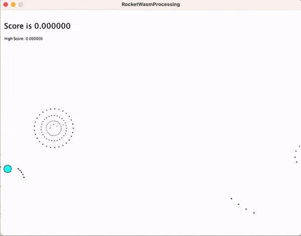
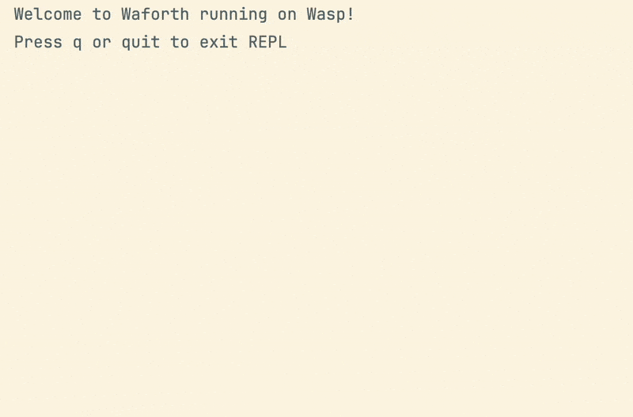
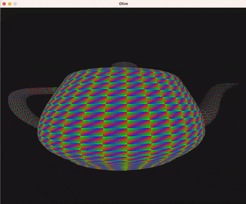

# A simple WASM interpreter in multiple languages

Inspired by [David Beazley's mindblowing talk](https://www.youtube.com/watch?v=r-A78RgMhZU) on live-coding [a WASM interpreter](https://gist.github.com/dabeaz/7d8838b54dba5006c58a40fc28da9d5a)

## wasp - Java WASM interpreter
- Runs Doom!


https://github.com/rrampage/wart/assets/1277046/7582e10e-e63d-4d33-9b9d-ddb850635e9f


- Runs Linux (very slowly!!) by running a RISC-V emulator compiled to WASM
  - `java --enable-preview -cp path_to_jar.jar rrampage.wasp.examples.RiscVEmulator`
### Currently implemented
#### Machine
- Stack push/pop works for i32, i64, f32 and f64
- Uses Java 21 pattern matching and records to implement instructions
- Arithmetic and comparison ops implemented
- Load/store with alignment and offset support
- Unary ops like popcnt, ceil, floor, trunc implemented
- Functions
  - call and call_indirect
  - Labels set/reset during/after function call
- Bitshift ops
- Blocks, loops and conditionals
- [Sign extension operations](https://github.com/WebAssembly/spec/blob/master/proposals/sign-extension-ops/Overview.md)
- [Non-trapping Float to Int conversions](https://github.com/WebAssembly/spec/blob/master/proposals/nontrapping-float-to-int-conversion/Overview.md)
- Start
- Exports
- Invoke exported functions

#### WAT Parser
- Instructions
- Imports
- Types
- Functions
- Block comments

#### WASM parser
- Magic bytes and version check
- Implement [LEB128](https://en.wikipedia.org/wiki/LEB128) decode
- Read section metadata
- Read sections
  - Type 
  - Import
  - Export
  - Start
  - Function
  - Table
  - Memory
  - Code
  - Data
  - Data count
  - Element
  - Global
- Module instantiation
  - Memory
  - Imports
  - Globals
  - Exports
  - Data Segments

#### Interop
- Import Java functions in WASM using MethodHandle for typesafe invoking

### More Demos!

- Runs [rocket.wasm](https://github.com/aochagavia/rocket_wasm)



- Can run a [Forth (Waforth)](https://github.com/remko/waforth) interpreter



- Renders olive.c examples



- Game of Life pulsar


### TODO
#### Machine
- Multi-valued Block types
- 128 bit vector (v128) data type and instructions
- external reference types
- GC ??
- Stack frames

#### WAT Parser
- Exports
- Memory
- Tables
- Start

#### WASM parser
- Implement [LEB128](https://en.wikipedia.org/wiki/LEB128) encode
- Read sections
  - Custom
- Module instantiation
  - Element Segments

#### Interop
- Use exported functions from Java
- Create support infrastructure to pass multiple imports
  - We do not have to pass imports while parsing. We can create stubbed-out functions using the type signature
  - Later, when instantiating machine, we can replace these stubbed functions with method handles from a HashMap<String, MethodHandle>

#### [Validation](https://webassembly.github.io/spec/core/valid/index.html)
- Limits must have meaningful bounds
- Block types must be expressed in one of 2 forms both of which are converted to function types
  - typeidx: `types[typeidx]` must be defined
  - valtype : `[] -> [valtype]`
- Table type limits for `reftype` must be valid within the range `2^32 -1`
- Memory type limits must be valid within the range `2^16`
- External types : the corresponding function / table / memory / global types must be valid
- Import subtyping: When instantiating a module, external values must be provided whose types are matched against the respective external types classifying each import.
  - Limits: External limits(min1, max1) matches limits(min2. max2) iff min1 >= min2 AND (max2 is empty OR (max1 and max2 are non-empty AND max1 <= max2))
  - Function types: External functype1 and functype2 are the same
  - Tables: External reftype table1(limits1, reftype1) matches table2(limits2, reftype2) iff limits1 matches limits2 AND reftype1 and reftype2 are the same
  - Memories: External memory1(limits1) matches memory2(limits2) iff limits1 matches limits2
  - Globals: External global1(globaltype1) matches global2(globaltype2) iff globaltype1 and globaltype2 are the same
- [Instructions](https://webassembly.github.io/spec/core/valid/instructions.html)
- [Modules](https://webassembly.github.io/spec/core/valid/modules.html)

## wag - Golang WASM interpreter
```bash
cd wag
go mod tidy
go test -v
```

### Currently implemented
- Works with i32
- Support for load/store
- Support for arithmetic
- Support for simple functions

### TODO:
- Branching
- Blocks
- Support i64, f32, f64
- Imports
- Run on simple wasm files

## References
### WASM opcode references:
- [Opcode table](https://pengowray.github.io/wasm-ops/)
- [MDN WASM Instruction reference](https://developer.mozilla.org/en-US/docs/WebAssembly/Reference)

## Tools:
### [`wasm-tools`](https://github.com/bytecodealliance/wasm-tools)
- Convert `wasm` to `wat` : `wasm-tools print my_file.wasm > my_file.wat`
- Generate valid WASM files: `head -c 1000 /dev/urandom | wasm-tools smith -o test.wasm`
- Generate valid WAT files: `head -c 1000 /dev/urandom | wasm-tools smith | wasm-tools print > test.wat`

### [Web Assembly Binary Toolkit (`wabt`)](https://github.com/WebAssembly/wabt)
- Convert `wat` to `wasm` : `wat2wasm my_file.wat` will create `my_file.wasm`
- Analyze wasm file: `wasm-objdump -x my_file.wasm`. 
  - `-x` shows section details
  - `-d` shows disassembly of all function bodies
  - `-s` shows section contents

### Standard coreutils / binutils
- Read wasm file as hex:
  - `xxd -u -g 1 my_file.wasm` or `hexdump -C my_file.wasm`
